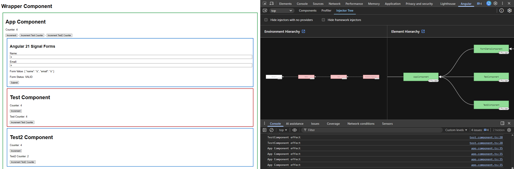

# Angular 21+ Zoneless & Signals Masterclass

[](https://angular.io/)
[](https://angular.io/guide/signals)
[](https://vitest.dev/)
[](https://angular.io/guide/zoneless)

> **Web components are best when we need true reusability, encapsulation, and framework-agnostic UI.**

This project is a cutting-edge exploration of **Angular 21**, pushing the boundaries of performance with **Zoneless Change Detection** and **Fine-grained Reactivity** using Signals.

---

## Key Features

- **Zoneless Architecture**: Zero dependency on `zone.js`. Lightning-fast performance and smaller bundle sizes.
- **Signal-First State**: Leveraging `signal()`, `computed()`, `input()`, and `output()` for precise reactivity.
- **Modern Testing**: Transitioned from Karma to **Vitest** for sub-second test execution.
- **Web Components (MFE Ready)**: Exporting Angular components as standalone Custom Elements via `@angular/elements`.
- **CD Visualization**: Integrated `injectCdBlink()` to visualize localized Change Detection cycles in real-time.

---

## Change Detection Visualizer (The "Blink" Effect)

We've implemented a custom utility `injectCdBlink()` to help understand how Angular 21 handles Change Detection without Zone.js.

### How it works:
- Whenever a component's state (Signal) changes, Angular triggers a localized CD check.
- The `injectCdBlink()` utility intercepts this and briefly highlights the component's border.
- **Result**: You can see exactly which component is being checked, proving that CD is no longer global but surgical.



---

## Tech Stack & Configuration

### Application Core
```typescript
// app.config.ts
export const appConfig: ApplicationConfig = {
  providers: [
    provideExperimentalZonelessChangeDetection(), // The magic happens here
    provideRouter(routes),
    provideHttpClient()
  ]
};
```

### Testing Infrastructure
We've ditched Karma for **Vitest**. It's faster, shares the same Vite pipeline, and provides a much better developer experience.

```bash
# Run tests
npm test
```

---

## Getting Started

### Prerequisites
- Node.js LTS
- Angular CLI 21+

### Installation
```bash
git clone https://github.com/leolanese/Angular19-Zoneless-standalone-webComponents-signals.git
cd Angular19-Zoneless-standalone-webComponents-signals
npm install
```

### Development
```bash
npm start
```
Navigate to `http://localhost:4200/`.

---

## Standards & Best Practices
- **Standalone Everything**: No `NgModules`.
- **Native Control Flow**: Using `@if`, `@for`, and `@switch`.
- **Strict Typing**: Full TypeScript compliance.
- **OnPush Logic**: Optimal productivity with `ChangeDetectionStrategy.OnPush`.

--- 

### Let's connect!

<a href="https://github.com/leolanese" target="_blank" rel="noopener noreferrer">
  
</a>

*Built for the Angular Community.*

- **Linkedin**: [LeoLanese](https://www.linkedin.com/in/leolanese/)
- **Twitter**: [@LeoLanese](https://twitter.com/LeoLanese)
- **Blog**: [Dev.to](https://www.dev.to/leolanese)
- **Contact**: developer@leolanese.com

---


